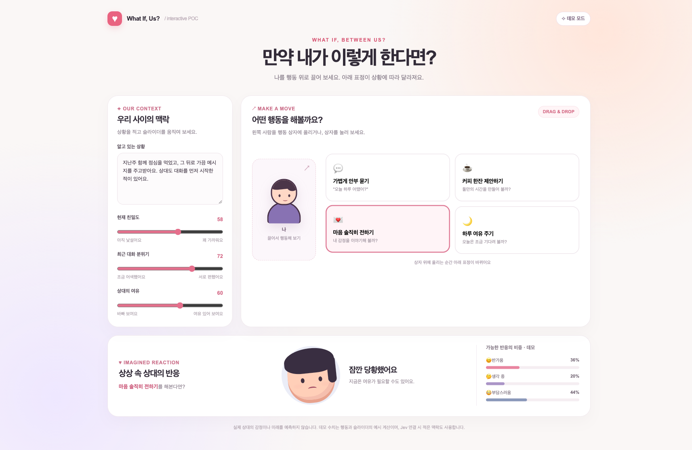

# OWO — Our What-if Orbit

Drag a character onto an action and watch an imagined reaction change below. This is a small interactive POC for exploring the concept of a Jev powered relationship scenario UI.



## Run locally

Requires Node.js 20 or newer. No packages to install.

```sh
node server.mjs
```

Open <http://127.0.0.1:4173>. Without an API key, the page uses a local example calculation based on the selected action and sliders. The text field affects Jev mode only.

The reaction card lets you switch between a pixel sprite, our generated face GLB, and the [CC0 MPFB external GLB](assets/models/README.md). The 3D models load when selected; the external model is 36 MB. Actions and context controls update the displayed reaction in all three styles.

The crying character animation preview is at <http://127.0.0.1:4173/sprite-preview.html>. It plays the four-frame sprite sheet and lets you adjust the speed.

The long-haired and sporty bob-haired female characters each have 16 reaction sheets under `sprites/female/` and `sprites/sporty-bob/`, with four frames per PNG. Switch between them and play the animations at <http://127.0.0.1:4173/female-sprite-preview.html>. The reactions cover idle, smile, laugh, shy, excited, curious, surprised, thinking, uncertain, nervous, uncomfortable, annoyed, sad, crying, waving, and turning away.

The [3D avatar research note](docs/avatar-glb-research.md) records GLB and VRM options, asset licenses, what was tested, and open limits. Two reproducible viewers and their model files are under [experiments/avatar-glb/](experiments/avatar-glb/): a generated face GLB with expression sliders and a VRoid sample with expressions and body motion.

The source for the embedded 3D viewer is under `experiments/avatar-glb/avatar-viewer/`. Its compiled browser bundle is committed at `assets/viewer/avatar-viewer.js`, so running this POC does not require installing dependencies. To rebuild it, run `cd experiments/avatar-glb/avatar-viewer && npm ci && npm run build`.

To try live Jev responses, set `TYPESAFE_API_KEY` in your shell before starting the server. The key stays on the local server and is never sent to the browser. Live requests use TypeSafe's `jev-1.13.0` model and may incur API charges.

## Scope

- Drag the person icon over an action to preview the expression; release to select it. Click or tap an action as an alternative.
- Adjust closeness, recent conversation, and the other person's availability.
- Jev mode sends the current state and one Choice question to the TypeSafe API. The server caches identical requests in memory for the current session.
- This UI explores hypothetical reactions. It cannot predict a real person's feelings or behavior.

The avatar, interaction design, and context controls are initial concept placeholders.
